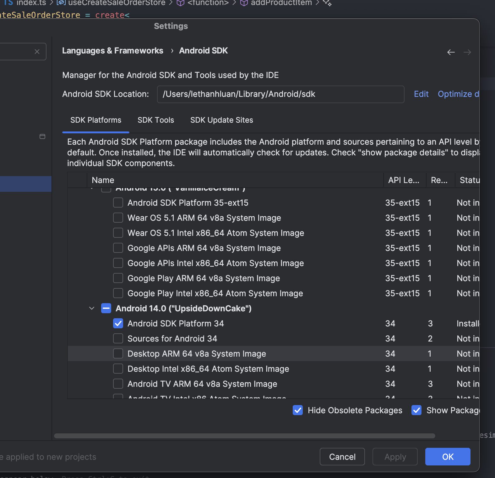
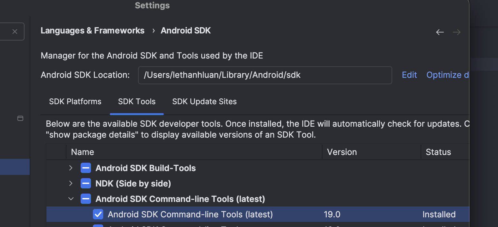

## Kiểm tra môi trường cho dự án

```sh
npx react-native doctor
```

# 1.FIX lỗi compile của source code

### 1.Thay đổi version các package ảnh hưởng đến compile

| No  | Package Name                 | Version  |
| --- | ---------------------------- | -------- |
| 1   | react-native-reanimated      | "3.14.0" |
| 2   | nativewind                   | "^4.2.1" |
| 3   | react-native-maps            | "1.17.3" |
| 4   | react-native-svg             | "15.4.0" |
| 5   | react-native-vision-camera   | "4.5.0"  |
| 6   | react-native-gesture-handler | "2.17.1" |

- Thêm vào trong dependencies thay version đang có

```json
{
  "react-native-reanimated": "3.14.0",
  "nativewind": "^4.2.1",
  "react-native-maps": "1.17.3",
  "react-native-svg": "15.4.0",
  "react-native-vision-camera": "4.5.0",
  "react-native-gesture-handler": "2.17.1"
}
```

### 2. Update packge conflict

- Thêm ngang cấp với devDependencies

```json
"resolutions": {
"react-native-css-interop": "0.1.22"
}
```

# 2.Setup môi trường cho Windows

### 2.1 Install choco package ( như homebrew Macos)

- Bật CMD quyền admin

```sh
@"%SystemRoot%\System32\WindowsPowerShell\v1.0\powershell.exe" -NoProfile -InputFormat None -ExecutionPolicy Bypass -Command " [System.Net.ServicePointManager]::SecurityProtocol = 3072; iex ((New-Object System.Net.WebClient).DownloadString('https://chocolatey.org/install.ps1'))" && SET "PATH=%PATH%;%ALLUSERSPROFILE%\chocolatey\bin"
```

- Kiểm tra choco đã cài đặt chưa

```sh
choco --version
```

output:

```sh
choco 0.12.15
```

### 2.2 Cài đặt jdk

Refer: https://reactnative.dev/docs/set-up-your-environment

```sh
choco install -y microsoft-openjdk17
```

Kiểm tra jdk đã cài đặt chưa

```sh
java -version
```

output:

```sh
java version "17.0.7" 2023-04-18 LTS
Java(TM) SE Runtime Environment 18.9 (build 17.0.7+10-LTS-392)
Java HotSpot(TM) 64-Bit Server VM 18.9 (build 17.0.7+10-LTS-392, mixed mode, sharing)
```

### 2.3 Cài đặt android studio

- Cài đặt android studio
  
  
  

### 2.4 SETUP ENV PATH

```sh
setx ANDROID_HOME "C:\Users\${YourUsername}\AppData\Local\Android\Sdk"
setx PATH "%PATH%;%ANDROID_HOME%\platform-tools;%ANDROID_HOME%\cmdline-tools\latest\bin;%ANDROID_HOME%\emulator"
```

Ví dụ:

```bat
setx ANDROID_HOME "C:\Users\luanlt15\AppData\Local\Android\Sdk"
setx PATH "%PATH%;%ANDROID_HOME%\platform-tools;%ANDROID_HOME%\cmdline-tools\latest\bin;%ANDROID_HOME%\emulator"
```

- Kiểm tra lại

```bat
echo %ANDROID_HOME%
where adb
sdkmanager --version
```

# 3. Setup môi trường cho MACOS

### 3.1 Install homebrew

Refer: https://brew.sh/

```bash
/bin/bash -c "$(curl -fsSL https://raw.githubusercontent.com/Homebrew/install/HEAD/install.sh)"
```

### 3.2 Install jdk

```bash
brew install openjdk@17
```

### 3.3 Cài đặt android studio


### 3.4 SETUP ENV PATH (trong file .zshrc hoặc .bash_profile hoặc .bashrc)

```bash
# Java
export JAVA_HOME=$(/usr/libexec/java_home -v 17)
export PATH=$JAVA_HOME/bin:$PATH

# Android SDK
export ANDROID_HOME=$HOME/Library/Android/sdk
export PATH=$PATH:$ANDROID_HOME/cmdline-tools/latest/bin
export PATH=$PATH:$ANDROID_HOME/emulator
export PATH=$PATH:$ANDROID_HOME/platform-tools
```

# 4. RUN APP

# 1. Install dependencies

```sh
 yarn
```

-- Nếu là IOS chạy thêm lệnh

```sh
  npx pod-install
```

# 2. Run app

### 2.1 Run android

- Bật máy ảo
- Nếu lỗi SSL do proxy ko download được gradle thì dowload file zip về (link: https://services.gradle.org/distributions/gradle-8.5.0-all.zip) không giải nén mà copy vào thư mục %USERPROFILE%\.gradle\wrapper\dists\gradle-8.5.0-all\<folder_hash>\

#### Cấu hình thêm tài nguyên Java heap space nếu máy ảo cần nhiều hơn

-- update trong file ./android/gradle.properties

```properties
org.gradle.jvmargs=-Xmx4096m -XX:MaxMetaspaceSize=512m -XX:+HeapDumpOnOutOfMemoryError -Dfile.encoding=UTF-8
```

#### Cấu hình proxy và certificate (nếu cần)

-Tạo hoặc thêm vào file %USERPROFILE%\.gradle\gradle.properties

```properties
  # CONFIGURATION CHO GRADLE
  systemProp.http.proxyHost=10.243.0.124
  systemProp.http.proxyPort=8080
  systemProp.https.proxyHost=10.243.0.124
  systemProp.https.proxyPort=8080
```

- Import Certificate

```sh
keytool -import -trustcacerts -file "<path_file_cert.crt>" -alias corporate-ssl-cert -keystore "%JAVA_HOME%\lib\security\cacerts"
```

Ví dụ:

```sh
keytool -import -trustcacerts -file "D:\cert_SSL_Decryption.crt" -alias corporate-ssl-cert -keystore "%JAVA_HOME%\lib\security\cacerts"
```

Tự tạo mật khẩu và chọn Trust this certificate? yes

#### Run app

```sh
yarn android
```

### 2.2 Run IOS

    ```sh
    yarn ios
    ```

# 3.Các lệnh xài simulator ANDROID

- Kiểm tra danh sách các máy ảo đã cài

```sh
emulator -list-avds
```

- Kiểm tra các máy ảo đang chạy

```sh
adb devices
```

- Chạy máy ảo

```sh
emulator -avd <avd_name> -gpu swiftshader_indirect -no-snapshot
```

Ví dụ:

```sh
emulator -avd Medium_Phone_API_36.0 -gpu swiftshader_indirect -no-snapshot
```
